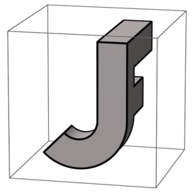
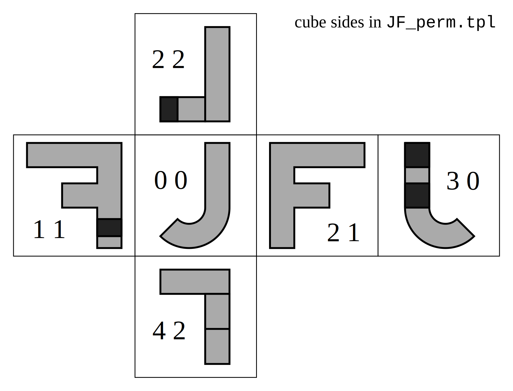
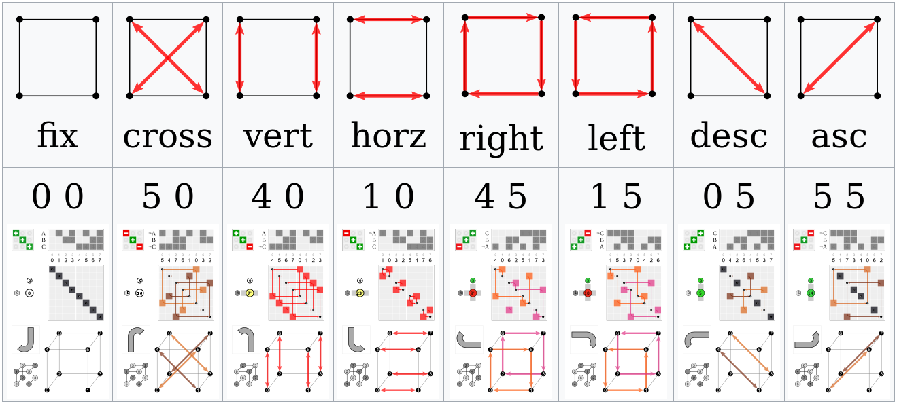

# Full octahedral group

This repo contains Python code used to create images for the Wikiversity article
[Full octahedral group](https://en.wikiversity.org/wiki/Full_octahedral_group).  
Each image represents one of the 48 permutations in the full octahedral group as a permutation of the cube.

Raytracing is done with [POV-Ray](https://en.wikipedia.org/wiki/POV-Ray).
Templating is done with [Bottle](https://en.wikipedia.org/wiki/Bottle_(web_framework)).

<table>
  <tr>
    <td>
      
    </td>
    <td>
      
    </td>
    <td>
      
    </td>
  </tr>
  <tr>
    <td>
      <a href="projects/p01_cube_permutation_vector_graphics">SVG</a>
    </td>
    <td>
      Raytracing <a href="projects/p02_cube_permutation_raytracing/views/plain.tpl">plain</a>
    </td>
    <td>
      Raytracing <a href="projects/p02_cube_permutation_raytracing/views/subgroup.tpl">subgroup</a>
    </td>
  </tr>
</table>

## Use

- Clone the repo: `clone https://github.com/watchduck/full_octahedral_group.git`
- Install a virtual environment in it: `virtualenv env`
- Turn it on: `source env/bin/activate`
- Install the [dependencies](requirements.txt): `pip install -r requirements.txt `
- Run `python app.py` in each of the project folders
- Files will be created in subfolders called FILES.

## Bottle templates

The lines in the `.tpl` files starting with `%` (or between `<%` and `%>`) are Python. 
So are parts between `{{` and `}}` in a line. (`{{!` is a variant of `{{`.)

Templating is not just used to create SVG files, but also to create Povray scene description files (`.pov`).
E.g. in [app.py](projects/p02_cube_permutation_raytracing/app.py) the template [plain.tpl](projects/p02_cube_permutation_raytracing/views/plain.tpl) is used with `t = template('plain', context)`.
The variable `transformations` from app.py is included in the template with `{{!transformations}}`.
The Povray scene description file generated from the template is `delete_me_after_use.pov`. This is rendered as an image with a name like `Cube permutation 0 0 JF.png` (see image in the middle above).

## JF compound

A side of the three-dimensional JF compound representing a cube permutation is also shown in each of the SVG files.
The six sides are included (`if JF_side ==`...) and permuted (`{{manipulation}}`) in [JF_perm.tpl](projects/p01_cube_permutation_vector_graphics/views/JF_perm.tpl). The permutations used for that were generated [here](projects/p01_cube_permutation_vector_graphics/prepare_JF_sides_and_manipulations.py) and copied to [constants.py](projects/p01_cube_permutation_vector_graphics/utils/constants.py) (`JF_sides_and_manipulations`).

<table>
  <tr>
    <td>
        
    </td>
    <td>
        
    </td>
  </tr>
  <tr>
    <td><code>JF_cube_sides</code></td>
    <td><code>manipulations</code></td>
  </tr>
</table>

## Representations

There are different ways to represent the elements of the full octahedral group:
- Pairs
- S4 based identifiers (n' or n+24 for n∘[inversion](https://commons.wikimedia.org/wiki/File:Cube_permutation_7_0.svg))
- 3×3 signed permutation matrices
- permutations of 8 elements (namely cube vertices)

A bijection between pairs and 3×3 matrices is found [here](projects/p01_cube_permutation_vector_graphics/tests.py) (`lin_transform_matrices`).

Bijections between pairs and S4 based identifiers (`pairs_to_num_bidict`) as well as pairs and permutations of 8 elements (`pairs_to_perm_bidict`) can be found [here](projects/p03_subgroups/store_dicts.py).
This file also contains a dictionary of all subgroups.
