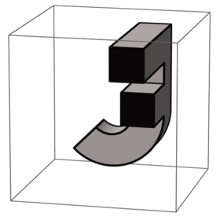
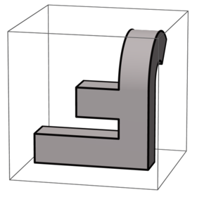
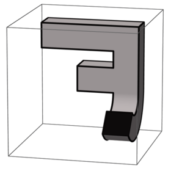
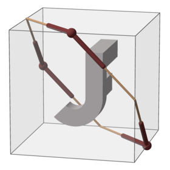
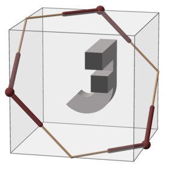
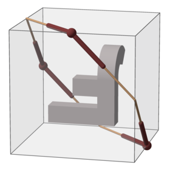
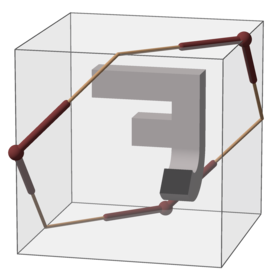
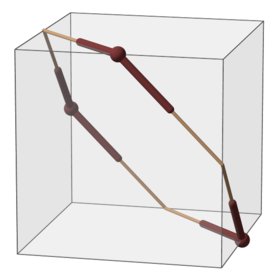

Two kinds of renderings are done here: Those of the plain JF compound, and those of brown example solids,
which illustrate the symmetry of the respective subgroup.

* plain in
[Full octahedral group; single elements; JF renderings](https://commons.wikimedia.org/wiki/Category:Full_octahedral_group;_single_elements;_JF_renderings)

* subgroups in
[Full octahedral group; subgroups; example solids](https://commons.wikimedia.org/wiki/Category:Full_octahedral_group;_subgroups;_example_solids)
, e.g.
[...permutations S3 blue 03](https://commons.wikimedia.org/wiki/Category:Full_octahedral_group;_subgroups;_example_solids;_permutations_S3_blue_03)
 (also brown example solids without JF)

<table>
    <tr>
        <td>(0, 0)</td>
        <td>(2, 0)</td>
        <td>(7, 1)</td>
        <td>(1, 1)</td>
        <td rowspan="3"></td>
    </tr>
    <tr>
        <td>
            
        </td>
        <td>
            
        </td>
        <td>
            
        </td>
        <td>
            
        </td>
    </tr>
    <tr>
        <td>
            
        </td>
        <td>
            
        </td>
        <td>
            
        </td>
        <td>
            
        </td>
    </tr>
    <tr>
        <td>
            
        </td>
        <td>
            
        </td>
        <td>
            
        </td>
        <td>
            
        </td>
        <td>
            
        </td>
    </tr>
</table>
