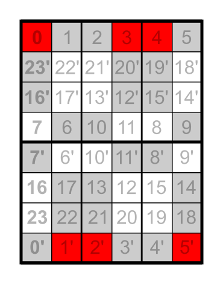

[`store_dicts.py`](store_dicts.py) contains a dict of subgroup names and their elements. 
Based on that, the 8×6 matrices in
[Full octahedral group; subgroups; matrix](https://commons.wikimedia.org/wiki/Category:Full_octahedral_group;_subgroups;_matrix)
are created in [`app.py`](app.py).

[`make_wiki_table.py`](make_wiki_table.py) is used to create tables like
[this one](https://en.wikiversity.org/wiki/Template:Full_octahedral_group;_solids;_S3_blue_03)
(which corresponds to the example matrix shown on the right).
The fields with the red border are those, where the brown example solid has the same position
as in the neutral permutation.

These tables can be found on the Wikiversity page
[Full octahedral group/List of all subgroups](https://en.wikiversity.org/wiki/Full_octahedral_group/List_of_all_subgroups).
